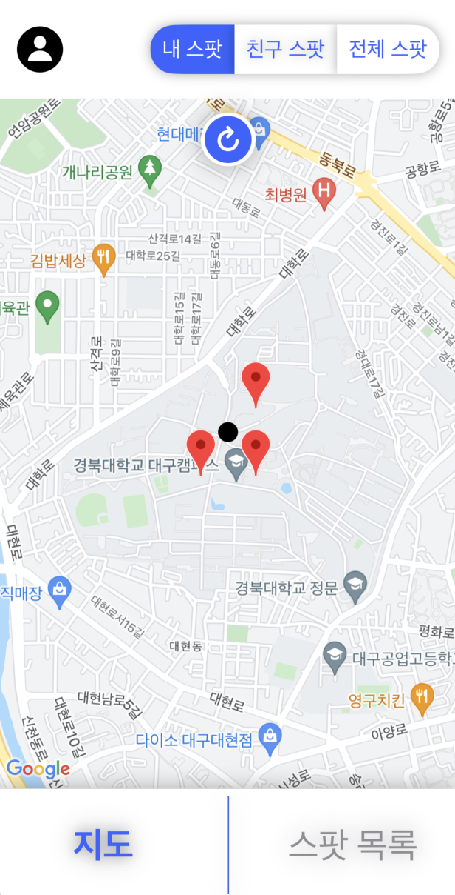
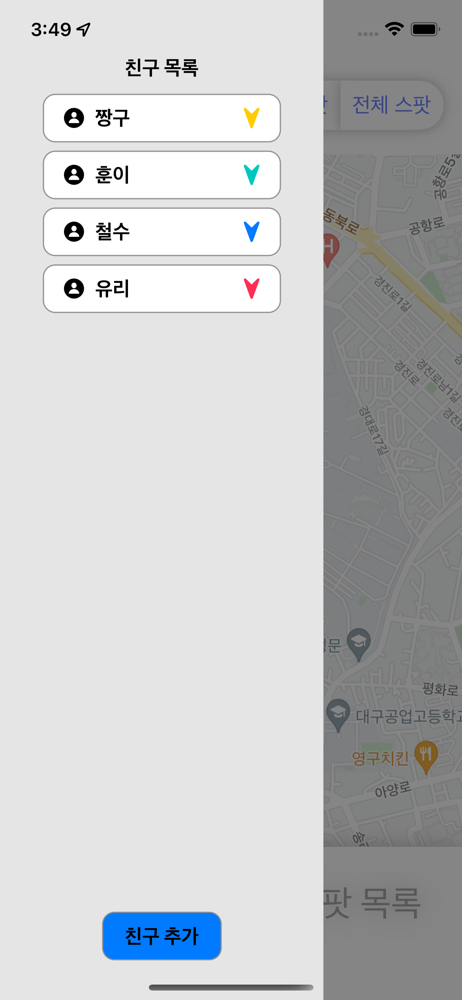

## 마이스팟
#### 지인과 지역 추천 장소를 공유해요 🧚🏻

## Contents
1. [서비스 개발 이유](#서비스-개발-이유)
2. [Guide](#Guide)
3. [Preview](#Preview)
4. [팀원 및 담당 역할 소개](#팀원-및-담당-역할-소개)
5. [Project Control](#Project-Control)

## 서비스 개발 이유
최근 여러 지도 어플에서 광고 및 작업 등으로 인해 사용자 후기 및 별점이 신뢰도를 잃어가고 있다. 이런 문제를 해결하고자 친구들의 **믿을 수 있는 스팟 공유**를 통해 신뢰도를 바탕으로 한 지도 어플을 개발하였다.

## Guide
1. 구글 로그인을 통해 로그인을 한다.
2. 내가 가봤던 좋은 장소를 마이스팟으로 저장한다.
3. 친구 등록을 통해 친구의 스팟을 공유할 수 있다.

## Preview
메인 페이지

## 팀원 및 담당 역할 소개
+ 배찬우
	+ Figma를 통해 어플 디자인 참여
    + 어플 기획, 방향 설계 및 회의 참여
+ 송현준
	+ Figma를 통해 어플 디자인 참여
    + 어플 기획, 방향 설계 및 회의 참여
    + 지도 API를 통해 지도 구현 및 핀추가, 관리 구현
+ 최윤석
	+ Figma를 통해 어플 디자인 참여
    + 어플 기획, 방향 설계 및 회의 참여
    + 친구 목록 페이지, 친구 추가 창, 로그인 페이지 구현
+ 황아영
    + Figma를 통해 어플 디자인 참여
    + 어플 기획, 방향 설계 및 회의 참여
    + Firebase 연동
	+ 스팟 목록 페이지 구현

## Project Control
+ Version Control :  Git, Github
+ Task Control : Notion, Figma
